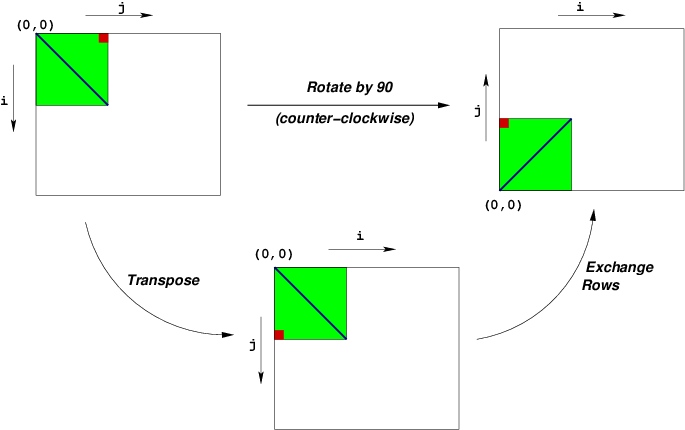

---
title: Rotate
...

>  Note: This homework is due ***at the same time*** as a checkpoint (partial progress)
>  submission for the next homework, [smooth](smooth.html)

# Task

1.  Download [rotate.tar](files/rotate.tar) on a Linux system.

2.  Run `tar xvf rotate.tar` to extract the tarball, creating the directory `rotate`.

3.  When running on department machines, run ‘module load gcc-7.1.0‘ before compiling code for rotate,
    in order to select the same compiler we will be using for testing.

3.  Edit `rotate.c` to make the `who_t` structure to include the your name and computing ID.
    You also need to supply a scoreboard name.
    We will publicly post the *last* performance results on a [scoreboard](rotateboard.html),
    which will use whatever scoreboard name you supply. (There will also be a 
    [more detailed result viewer](https://kytos.cs.virginia.edu/cs3330/rotateviewer/){target="_top"}
    only visible to you.)

4.  In `rotate.c`, create new implementations of `rotate` that perform the same calculation
    as `naive_rotate`, but will be faster. Modify `register_rotate_functions` to include
    each of these functions.

    You **may not** attempt to interfere with the code that will time your new implementations
    of `rotate`. (See [other rules](#other rules) below.)

    Your functions only need to work for multiple-of-32 dimension values.
    
5.  Test your implementation to make sure it is correct and to see what average speedup it gets.
    To get full credit, your speedup should be at least 2.7 ***on our testing machine***. (See [grading](#grading) below for
    more details.)

    1.  You can run `make` to build `./benchmark` to test your rotate implementation on
        your own machine or on a department machine. On
        the department machines, you can get access to the same compiler we will use to test your
        submission by running `module load gcc-7.1.0`.
        
        Usually, if version A of rotate is
        significantly faster on your machine, it will also be faster on ours, but
        the amount faster may vary significantly. The most notable exception is if your machine has
        a different compiler (e.g. `gcc` is actually some version of Clang and not some version of GCC,
        like on a typical OS X machine); one way to mitigate this effect by testing on the department servers.

        You should always do this before submitting something for our
        server to run to make sure your new version of rotate performs the correct calculation.

    2.  If you submit `rotate.c` to [kytos](https://kytos.cs.virginia.edu/cs3330/){target="_top"}, we
        will time it on our machine and post the results
        [here](https://kytos.cs.virginia.edu/cs3330/rotateviewer/){target="_top"}.
        It may take 30-60 miuntes for us to run your submission, and perhaps more if we receive
        a lot of submissions in a short amount of time.

# Collobaration Policy

The following kinds of conversations are permitted with people other than the course staff:

*	drawings and descriptions of how you want to handle memory accesses across an image

*	code snippets explaining optimizations, but only for code unlike the smooth and rotate problems we are discussing

*	discussion of the code we provide you: how `RIDX` works, what the naive implementations are doing, etc.

# Other rules

Violations of the following rules will be seen as cheating, subject to penalties that extend beyond the scope of this assignment:

*	You must not modify or interfere with the timing code 
*	You must not attempt to inspect or modify the network, disk, or other grading platform resources

Violations of the following rules will be seen as unprofessional conduct, subject to penalties that extend beyond the scope of this assignment:

*	You must not use a scoreboard name that is offensive or insulting

Additionally, the following rules may result in grade penalties within this assignment if violated:

*	You must write valid C code. (But you may use GCC-specific extensions.)
*	You should not turn in code that contains print statements.
*	Your code must work (i.e., the same functionality as the provided naive implementations) for any image of any multiple-of-32 dimension (32, 64, 96, etc).
*   You must not override command-line optimization options we pass to mostly prevent the compiler from generating vector instructions other than when vector intrinsic are used. That is, you must not use GCC extensions that allow C code in a file to temporarily change the command-line compiler optimizations flags in order to the make the optimizer generate more vector instructions for code that does not use vector intrinsics or otherwise explicitly identify how to use vector instructions.

# Rotate Task Overview

This assignment deals with optimizing memory-intensive code.   You will be optimizing an image processing operation we will call "rotate", which rotates an image counter-clockwise by 90◦.

We will consider an image to be represented as a two-dimensional matrix *M*, where *M**i*,*j* denotes the value of (*i*, *j*)th pixel of *M*. Pixel values are triples of red, green, and blue (RGB) values. We will only consider square images. Let *N* denote the number of rows (or columns) of an image.  Rows and columns are numbered, in C-style, from 0 to *N* − 1.

Given this representation, the rotate operation can be implemented quite simply as the combination of the following two matrix operations:

*	Transpose: For each (*i*, *j*) pair, *M**i*,*j* and *M**j*,*i* are interchanged.
*	Exchange rows: Row *i* is exchanged with row *N* − 1 − *i*.

This combination is illustrated in the following figure:

Note that:

*       Performance of the baseline implementation is substantially worse at some sizes.
*       Most benchmarked sizes have been chosen to be very large to emphasize certain kinds of performance effects.

# Code

## Structures we give you

A pixel is defined in `defs.h` as

	typedef struct {
	    unsigned char red;
	    unsigned char green;
	    unsigned char blue;
            unsigned char alpha;
	} pixel;

(The "alpha" component represents transparency.)

In memory, this takes up 4 bytes, one byte for red, followed by one byte for green, and so on.

Images are provided in flattened arrays and can be accessed by `RIDX`, defined as

	#define RIDX(i,j,n) ((i)*(n)+(j))

by the code `nameOfImage[RIDX(index1, index2, dimensionOfImage)]`.

All images will be square and have a size that is a multiple of 32.

## What you should change

In `rotate.c` you will see several rotate functions.

*	`naive_rotate` which shows you what a naive implementation looks like. Your code must produce the same result as this.

*	You may add as many other rotate methods as you want. You *should* put each new optimization idea in its own method: `rotate_outer_loop_unrolled_3_times`, `rotate_with_2_by_3_blocking`, etc. The driver will compare all your versions  as long as you register them in the `register_rotate_functions` methods.

The source code you will write will be linked with object code that we supply into a `benchmark` binary. To create this binary, you will need to execute the command

        $ make

You will need to re-make the benchmark program each time you change code in `rotate.c`. To test your implementations, you can run the command:
    
        $ ./benchmark

If you want to only run a particular function, you can run

        $ ./benchmark 'foo'

to only run benchmark functions whose name contains "foo".

***Note that the benchmark results on your machine and the shared lab servers are often different
than our grading machine***. Generally, we've found that optimizations that make code significantly
faster on other machines usually make code significantly faster on our grading machine. However, the amount
of speedup may be quite different.

## Measuring on our grading machine

You can ***measure the performance on our grading machine*** by submitting a version of `rotate.c`
to [kytos](https://kytos.cs.virginia.edu/cs3330/).

We will periodically scan for new submissions and run them on our grading server.

You can view detailed results [here](https://kytos.cs.virginia.edu/cs3330/rotateviewer/), which include the times for each version you submitted.

In addition, your last result will appear on a [public scoreboard](rotateboard.html).

## Correctness Testing

If one of your implementation produces a wrong answer, you can test it with the `./test` program,
which will show you its complete input and output.

To run this, first build it by running

        $ make

then choose a size to test (e.g. `4`), and to test your rotate function named `rotate_bar` use:

        $ ./test "rotate_bar" 4

The `./test` program will run all test functions whose description contains the supplied string. For example,
the above command would run a function whose description was `rotate_bar: version A` 
as well was one whose description was `bad_rotate_bar_and_baz: version B`.

Note that **`./test` can run your program on sizes that are not required to work**. In particular, we do not
require your functions to work on non-multiple-of-32 sizes, but you may find sizes smaller than
32 convenient for debugging.

# Grading

The benchmark program tests your program at several sizes, computes the speedup over the naive
code at each size, then takes the geometric mean of these results to get an overall speedup number.
This is what we will use to grade.
*
Speedups vary wildly by the host hardware. I have scaled the grade based on my timing server's hardware so that particular strategies will get 75% and 100% scores.

Rotate will get 0 points for 1.0× speedups *on my computer*, 75% for 1.80×, and 100% for 2.7× speedups, as expressed in the following pseudocode:

	if (speedup < 1.00) return MAX_SCORE * 0;
	if (speedup < 1.80) return MAX_SCORE * 0.75 * (speedup - 1.0) / (1.80 - 1.0);
	if (speedup < 2.70) return MAX_SCORE * (0.75 + 0.25 * (speedup - 1.80) / (2.70 - 1.80));
	return MAX_SCORE;

If you submit many times, your grade will be based on the version submitted that results
in the best score, taking late penalties into account.

# About our Testing Server

We will be testing the performance of this program on *our machine*.
We will be build your programs with GCC 7.1.0, which is available on
portal.cs.virginia.edu or via NX remote desktop after running `module load gcc-7.1.0`.
For this compiler
`gcc --version` outputs `gcc (GCC) 7.1.0`. We
will compile your submitted files using the options `-g -Wall -O2 -std=gnu99 -mavx2 -mtune=skylake -fno-strict-aliasing -fno-tree-vectorize`.

Our testing server has an Intel "Kaby Lake" processor with the following caches:

*   A 32KB, 8-way set associative L1 data cache;
*   A 32KB, 8-way set associative L1 instruction cache;
*   A 256KB, 4-way set associative L2 cache, shared between instructions and data;
*   A 8MB, 16-way set associative L3 cache, shared between instructions and data;

The size of a cache block in each of these caches is 64 byte.

Things about our processor that some students might want to know but probably aren't that important:

*   Our processor also has a 4-way set associative 64-entry L1 data TLB, an 8-way set associative 128-entry
L1 instruction TLB, and an 6-way set associative 1536-entry L2 TLB (shared between instructions and
data).

# Hints

## On bottlenecks in rotate

Note that the rotate operation involves little computation and a lot of memory
accesses to both `src` and `dest`, so its performance likely heavily depends on how
efficient those memory accesses are.

## Kinds of optimizations

The following is a non-comprehensive list of optimization techniques,
which may or may not be applicable to this assignment:

*  changing loop orders to improve cache locality;
*  cache blocking, with various block sizes in each dimension, to improve cache locality;
*  loop unrolling, with various amounts of unrolling;
*  using multiple accumulators;
*  using temporary variables so the compiler can know there is no aliasing; e.g. instead of

        for (int i = 0; i < N; ++i) {
            result[i] = 0;
            for (int j = 0; j < N; ++j)
                result[i] += matrix[i*N+j];
        }

    writing

        for (int i = 0; i < N; ++i) {
            int row_sum = 0;
            for (int j = 0; j < N; ++j)
                row_sum += matrix[i*N+j];
            result[i] = row_sum;
        }

*  function inlining (copying the body of a function into where it is used to avoid function call overhead)
*  encouraging reused values to be kept in registers by using temporary variables;
*  using instructions that act on more data at once (e.g. instructions that load/store multiple values at once or add multiple values at once), like the SIMD instructions;
*  removing redundant operations from a loop, e.g. converting code like

        for (int i = 0; i < strlen(foo); ++i) {
            ...
        }

    to code like

        int len = strlen(foo);
        for (int i = 0; i < len; ++i) {
            ...
        }

*  simplifying address calculations
    

## Miscellaneous optimization hints

*  Some optimizations you may want to try have parameters to choose, like the number of
   times to unroll the loop. We suggest trying several values of the parameter --- it
   may be the case that the optimization appears not to work but you just choose
   a much too high or too low parameter.
*  Loop unrolling combines effectively with other optimizations like multiple accumulators
   effectively.
*  For optimizations that attempt to benefit from the cache, it may be helpful to consider
   what sequences of addresses are being accessed in iterations of the inner loops.

   Note that optimizations could help avoid both capacity (not enough room in a cache) misses
   and conflict (too many things map to the same set) misses.
*  For a loop with a fixed number of iterations, loop unrolling is sometimes a lot more effective 
   if you can eliminate the loop entirely.
*  *Sometimes* the compiler will generate unnecessarily complicated address calculation code. This can
   *  performing multiplications to compute addresses when the address could be computed by
      adding to the address from the previous iteration;
   *  adding to addresses computed in the previous iterations instead of multiplying, but
      storing addresses on the stack to do so instead of adding to related addresses
      from the same iteration, etc.;
   
   If you have evidence that this is occuring, a fix can be 
   to write more explicit address computation code that
   *  avoids most multiplications in computing addresses; and/or
   *  compute the address of one element by adding to the address of the previous as in
        
            int *x = &array[i * N + j];
            int *y = x + N; /* instead of &array[(i+1) * N + j] */

*  We provide you with performance numbers at each of the sizes we test. Observe that
   some optimizations may have little effect on certain sizes, but very large
   effects on others.
*  It is permissible for your function to use different techniques depending on the input size.
